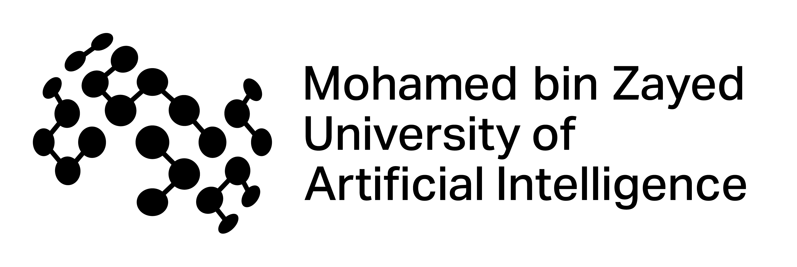
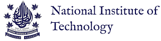

## About Me

I am currently a PhD Candidate at [Mohamed Bin Zayed University of Artificial Intelligence (MBZUAI)](http://www.mbzuai.ac.ae) and before that have  obtained my Masters degree in computer vision from the same institution. At MBZUAI, I am affliated with the [Intelligent Visual Analytics Lab (IVAL)](https://www.ival-mbzuai.com/) where I am primarily advised by [Dr. Salman Khan](https://salman-h-khan.github.io/) and have a close collaboration with [Dr. Muzammal Naseer](https://muzammal-naseer.com/). My secondary advisor is [Dr. Fahad Khan](https://sites.google.com/view/fahadkhans/home). 

I received my undergraduate degree in Electronics and Communication Engineering with a minor in Computer Science from the [National Institute of Technology (NIT) Srinagar, India](https://nitsri.ac.in/). 
After graduation, I worked as a researcher at Indian Institute of Science [IISc](https://iisc.ac.in/), before transitioning into academia in 2020 and joining MBZUAI as a Masters Student under [Dr. Salman Khan](https://salman-h-khan.github.io/).

    

        
        
MBZUAI (2021-Present)

    

    

        
       
NIT Srinagar (2014-2018)

    

## Research Interests

My research focuses on the Safety and Reliability of AI, with a particular emphasis on understanding, evaluating, and enhancing the robustness of vision-based models.

## News
- **[August. 2025]**  Our work <strong><a href="https://hashmatshadab.github.io/Robust-LLaVA/">Robust-LLaVA</a></strong> will be presented in Trustworthy FMs Workshop workshop at **ICCV 2025**! 🎉
- **[June. 2025]**  Our work [HSAT](https://arxiv.org/abs/2503.10629) has been accepted at **MICCAI 2025**! 🎉
- **[Mar. 2025]** Our work titled "[Towards Evaluating the Robustness of Visual State Space Models](https://arxiv.org/abs/2406.09407)" got accepted at **CVPRW 2025**! 🎉
- **[Mar. 2025]** Our work [HSAT](https://arxiv.org/abs/2503.10629), enhances robustness of histopathology vision models by leveraging patient-slide-patch relationships to construct heirarchy-wise attacks and integrate the generated adversarial examples in the model training. HSAT achieves a 54.31% improvement against white-box attacks and reduces performance drop to 3-4% against black-box attacks.
- **[Feb. 2025]**   Our work <strong><a href="https://hashmatshadab.github.io/Robust-LLaVA/">Robust-LLaVA</a></strong>, enhances the adversarial robustness of Multi-modal Large Language Models (MLLMs) by leveraging large-scale robust classification models.
              It achieves <strong>2×</strong> and <strong>1.5×</strong> average robustness gains in <em>captioning</em> and <em>VQA</em> tasks, and improves resistance to <em>jailbreaking attacks</em> by over <strong>10%</strong> compared to state-of-the-art methods.
- **[Dec. 2024]** Our work titled “[ObjectCompose: Evaluating Resilience of Vision-Based Models on Object-to-Background Compositional Changes](https://arxiv.org/abs/2403.04701)” secured **Best Student Paper Runner Up Award** at **ACCV 2024**! 🎉.
- **[Sep. 2024]** Our work titled “[ObjectCompose: Evaluating Resilience of Vision-Based Models on Object-to-Background Compositional Changes](https://arxiv.org/abs/2403.04701)” got accepted at ACCV 2024 for **Oral Presentation (Top 5%)**! 🎉.
- **[June. 2024]** Our paper titled “[Evaluating Robustness of Volumetric Medical Segmentation Models](https://arxiv.org/abs/2406.08486)” got accepted at **BMVC 2024**! 🎉
- **[Jan. 2023]** I joined MBZUAI as a PhD student in Computer Vision with full scholarship.
- **[Sep. 2022]** Our work titled “[Adversarial Pixel Restoration as a Pretext Task for Transferable Perturbations](https://arxiv.org/abs/2207.08803)” got accepted at BMVC 2022 for **Oral Presentation (Top 9%)**! 🎉.
- **[Jan. 2021]**  I joined MBZUAI as a Masters student in Computer Vision with full scholarship.




