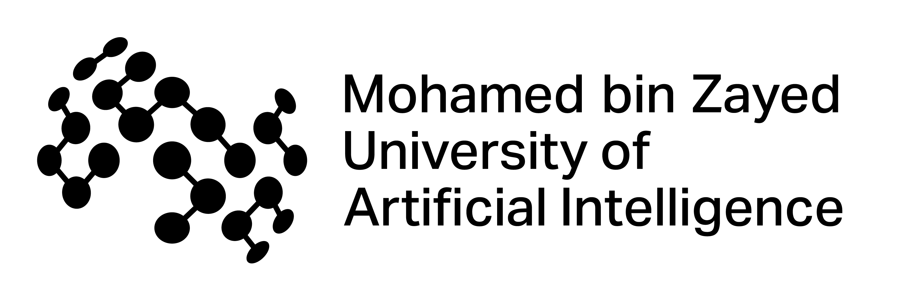
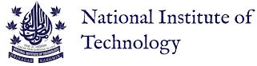

## About Me

I am a PhD Candidate at [Mohamed Bin Zayed University of Artificial Intelligence (MBZUAI)](http://www.mbzuai.ac.ae) in the [Intelligent Visual Analytics Lab (IVAL)](https://www.ival-mbzuai.com/). I am primarily advised by [Dr. Salman Khan](https://salman-h-khan.github.io/) and [Dr. Muzammal Naseer](https://muzammal-naseer.com/), with [Dr. Fahad Khan](https://sites.google.com/view/fahadkhans/home) as my secondary advisor.

I hold a Master's degree in Computer Vision from MBZUAI and an undergraduate degree in Electronics and Communication Engineering from the [National Institute of Technology (NIT) Srinagar](https://nitsri.ac.in/). Previously, I was a researcher at the [Indian Institute of Science (IISc)](https://iisc.ac.in/).

## Education

    

        
        
MBZUAI (2021-Present)

    

    

        
       
NIT Srinagar (2014-2018)

    

## Research Interests

My research focuses on the **Safety and Reliability of AI**, with a particular emphasis on understanding, evaluating, and enhancing the **robustness of vision-based models**.

## News

- **[Aug. 2026]** Three of our works have been accepted to the **37th British Machine Vision Conference (BMVC) 2026**! 🎉
- **[Jul. 2026]** Our new work **[ReACT-CLIP](https://arxiv.org/abs/2608.01067)** proposes a training-free test-time defense for CLIP that adapts its defensive strength based on the given sample, achieving high robust accuracy across attack strengths and beating the strongest prior test-time defense by up to 46.5%.
- **[Jul. 2026]** Our work **[CORTEX](https://arxiv.org/abs/2606.27264)** was accepted to the **[SAFER Workshop](https://safer-workshop.github.io/) at MICCAI 2026**, where it was **selected for an oral presentation**! 🎉
- **[Jun. 2026]** Our work **[HistoVL](https://arxiv.org/abs/2503.12990)** was accepted to **MIUA 2026**, where it was **selected for an oral presentation**! 🎉
- **[Dec. 2025]** Our work **FaceGuardian** was accepted to **SaTML 2026**, where it was **selected for both an oral and poster presentation**! 🎉
- **[Aug. 2025]** Our work **[Robust-LLaVA](https://hashmatshadab.github.io/Robust-LLaVA/)** was accepted to the **Trustworthy Foundation Models Workshop at ICCV 2025**, where it was **selected for an oral presentation**! 🎉
- **[Jun. 2025]**  Our work [HSAT](https://arxiv.org/abs/2503.10629) has been accepted at **MICCAI 2025**! 🎉
- **[Mar. 2025]** Our work titled "[Towards Evaluating the Robustness of Visual State Space Models](https://arxiv.org/abs/2406.09407)" got accepted at **CVPRW 2025**! 🎉
- **[Mar. 2025]** Our work [HSAT](https://arxiv.org/abs/2503.10629), enhances robustness of histopathology vision models by leveraging patient-slide-patch relationships to construct heirarchy-wise attacks and integrate the generated adversarial examples in the model training. HSAT achieves a 54.31% improvement against white-box attacks and reduces performance drop to 3-4% against black-box attacks.
- **[Feb. 2025]** Our work **[Robust-LLaVA](https://hashmatshadab.github.io/Robust-LLaVA/)**, enhances the adversarial robustness of Multi-modal Large Language Models (MLLMs) by leveraging large-scale robust classification models. It achieves **2×** and **1.5×** average robustness gains in *captioning* and *VQA* tasks, and improves resistance to *jailbreaking attacks* by over **10%** compared to state-of-the-art methods.
- **[Dec. 2024]** Our work titled “[ObjectCompose: Evaluating Resilience of Vision-Based Models on Object-to-Background Compositional Changes](https://arxiv.org/abs/2403.04701)” secured **Best Student Paper Runner Up Award** at **ACCV 2024**! 🎉.
- **[Sep. 2024]** Our work titled “[ObjectCompose: Evaluating Resilience of Vision-Based Models on Object-to-Background Compositional Changes](https://arxiv.org/abs/2403.04701)” got accepted at ACCV 2024 for **Oral Presentation (Top 5%)**! 🎉.
- **[Jun. 2024]** Our paper titled “[Evaluating Robustness of Volumetric Medical Segmentation Models](https://arxiv.org/abs/2406.08486)” got accepted at **BMVC 2024**! 🎉
- **[Jan. 2023]** I joined MBZUAI as a PhD student in Computer Vision with full scholarship.
- **[Sep. 2022]** Our work titled “[Adversarial Pixel Restoration as a Pretext Task for Transferable Perturbations](https://arxiv.org/abs/2207.08803)” got accepted at BMVC 2022 for **Oral Presentation (Top 9%)**! 🎉.
- **[Jan. 2021]**  I joined MBZUAI as a Masters student in Computer Vision with full scholarship.




